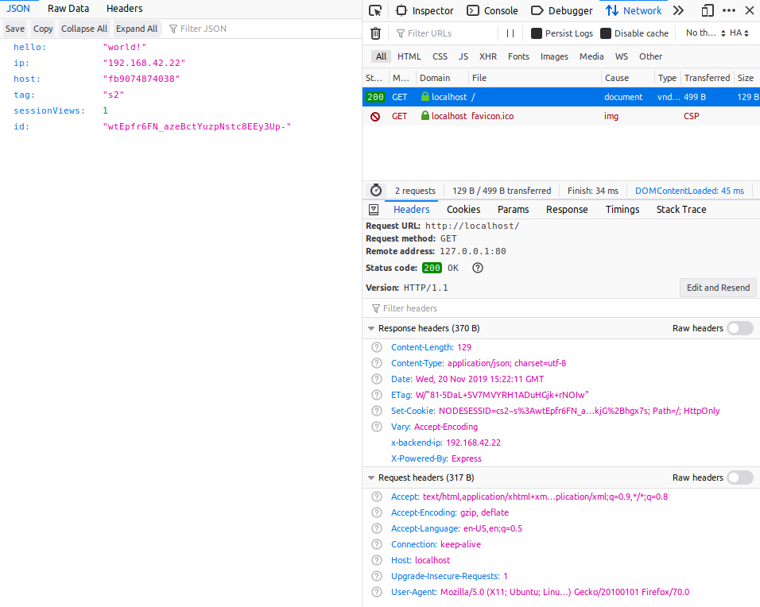
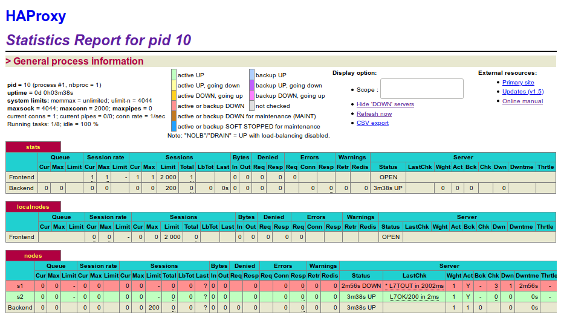

# Lab 03 - Load balancing

Authors : Caroline Monthoux, Rémi Poulard

Date : 27.11.2019

### Task 1: Install the tools

**Deliverables:**

> 1. Explain how the load balancer behaves when you open and refresh the URL <http://192.168.42.42> in your browser. Add screenshots to complement your explanations. We expect that you take a deeper a look at session management.

The load balancer seems to use the **roundrobin** policy. In order to verify this statement, we refresh the URL <http://192.168.42.42> in our browser several times.

Here is the result for the first access.


Then, the second access.


As we repeat the process, we can observe the same pattern over and over again. The load balancer alternated between the two servers. 

It is interesting to look at both the `id` fields. They are not the same, suggesting that each server has opened a different session with the client. But there is something worst : the `id` doesn't remain the same, even on the same server.


As we can see, the `id` has changed between refreshes on server 1. In conclusion, session management is close to zero.

We can confirm that the reverse proxy uses roundrobin policy by looking at `/ha/config/haproxy.cfg`.


> 2. Explain what should be the correct behavior of the load balancer for session management.

The load balancer should use **sticky sessions**. This means that once a server responds to a request with a session id, the load balancer should route the future requests for this particular session to the same server that serviced the first request.

> 3. Provide a sequence diagram to explain what is happening when one requests the URL for the first time and then refreshes the page. We want to see what is happening with the cookie. We want to see the sequence of messages exchanged (1) between the browser and HAProxy and (2) between HAProxy and the nodes S1 and S2. Here is an example:
>

Here is the sequence diagram :


> 4. Provide a screenshot of the summary report from JMeter.

As we can see below, on 1000 samples, there is a 50/50 distribution since S1 and S2 have both been reached 500 times by the same thread.


> 5. Run the following command:
>
> ```bash
> $ docker stop s1
> ```
>
> Clear the results in JMeter and re-run the test plan. Explain what is happening when only one node remains active. Provide another sequence diagram using the same model as the previous one.

Here is the result of the test plan run.


Now, every GET request reaches S2. This time, the session `id` is correctly reused and the `sessionViews` counter increments correctly.


And, after a refresh.


Here is the sequence diagram.


### Task 2: Sticky sessions

**Deliverables:**

> 1. There is different way to implement the sticky session. One possibility is to use the SERVERID provided by HAProxy. Another way is to use the NODESESSID provided by the application. Briefly explain the difference between both approaches (provide a sequence diagram with cookies to show the difference).

* Using SERVERID :

This approach consists of configuring the load-balancer to inject a cookie in the client browser. First, we have to add the following line in the configuration file `ha/config/haproxy.cfg` :

```bash
cookie SERVERID insert
```

It tells HAProxy to setup a cookie called SERVERID only if the user did not come with such cookie.

Then, we modify the following lines :

```bash
server s1 ${WEBAPP_1_IP}:3000 cookie cs1 check
server s2 ${WEBAPP_2_IP}:3000 cookie cs2 check
```

Here, we added `cookie csX` before `check`. It provides the value of the cookie inserted by HAProxy. When the client comes back, then HAProxy knows directly which server to choose for this client.


* Using NODESESSID :

This approach consist of configuring the load-balancer to use the cookie setup by the application server to maintain affinity between the server and a client. We add the following lines in `ha/config/haproxy.cfg` :

```bash
cookie NODESESSID prefix
server s1 ${WEBAPP_1_IP}:3000 cookie cs1 check
server s2 ${WEBAPP_2_IP}:3000 cookie cs2 check
```

We use the `NODESESSID` since it is a NodeJS application. 

Here, when the server first responds to a client, a `Set-Cookie:NODESESSID=...` is set in the header. When passing through HAProxy, the cookie is modified like this : `Set-Cookie:NODESESSID=cs1~...`.

Then, for its second request, the client will send a request containing : `Cookie:NODESESSID=cs1~...`. Finally, HAProxy will clean it up on the fly to set it up back like the origin : `Cookie:NODESESSID=...` and forward the request to the right server.


> Choose one of the both stickiness approach for the next tasks.

> 2. Provide the modified `haproxy.cfg` file with a short explanation of the modifications you did to enable sticky session management.

We chose to use `NODESESSID`. The modifications we did in the configuration file and the explanations can be found in the previous question.

> 3. Explain what is the behavior when you open and refresh the URL <http://192.168.42.42> in your browser. Add screenshots to complement your explanations. We expect that you take a deeper look at session management.

The first time we get on the site, HAProxy simply forwards the request to an available server :



As we can see, the request didn't include any cookie. Once the server sends the response with a `Set-Cookie` header, HAProxy intercepts it and modify the cookie by adding `cs2~` before the node session id value.

On a refresh :


This time, the client has sent his cookie in the `Cookie` header. We can see that the `cs2~` is still here. Now, and for each of our requests, HAProxy will clean up this addition and send them to server 2. 

> 4. Provide a sequence diagram to explain what is happening when one requests the URL for the first time and then refreshes the page. We want to see what is happening with the cookie. We want to see the sequence of messages exchanged (1) between the browser and HAProxy and (2) between HAProxy and the nodes S1 and S2. We also want to see what is happening when a second browser is used.


> 5. Provide a screenshot of JMeter's summary report. Is there a difference with this run and the run of Task 1? Give a short explanation of what the load balancer is doing.

This time, there is two threads accessing the page.


We see that the roundrobin policy with sticky session works well. On 2000 samples, S1 has been reached 1000 times by thread1, and S2 has been reached 1000 times by thread2. On contrary to the run of Task 1, where only one thread was accessing the two servers.

The load balancer did the following : when thread1 requested the page, it sent the job to S1, which generated a cookie for thread1. Then, thread2 requested the page and the job was given to S2, which generated a cookie for thread2.


### Task 3: Drain mode

**Deliverables:**

> 1. Take a screenshot of the Step 5 and tell us which node is answering.


We can see that node S1 is answering. Under `Sessions` label, we can observe that the column `LbTot` is set to `1`. This column is a counter of how many times this node was selected. There is also the `Total` column that summarizes how many requests came to this node.


> 2. Based on your previous answer, set the node in DRAIN mode. Take a screenshot of the HAProxy state page.


> 3. Refresh your browser and explain what is happening. Tell us if you stay on the same node or not. If yes, why? If no, why?

It is still the same server that is responding. That is because the DRAIN state means that the server will not accept any new connections, but connection with a session already established are still available to go on this node.


> 4. Open another browser and open `http://192.168.42.42`. What is happening?

This time, it is the other node that is answering us.


> 5. Clear the cookies on the new browser and repeat these two steps multiple times. What is happening? Are you reaching the node in DRAIN mode?

It is always the node S2 (the one not in DRAIN state) that is answering us. It is because we are creating new connections, so we are always redirected to the node S2.

> 6. Reset the node in READY mode. Repeat the three previous steps and explain what is happening. Provide a screenshot of HAProxy's stats page.

The connection that was still on S1, because the session was already set, has been redirected to S2 with a new session. This could be a problem and could cause inconsistent behaviors for the user.

When we create a new connection with an other browser, it is the node S1 that is responding us. The roundrobin sticky session policy is functioning again.


> 7. Finally, set the node in MAINT mode. Redo the three same steps and explain what is happening. Provide a screenshot of HAProxy's stats page.

For every connections, new or already setup, it is the node S2 that is answering. This means that all sessions that were on S1 are lost.


### Task 4: Round robin in degraded mode.

**Deliverables:**

*Remark*: Make sure you have the cookies are kept between two requests.

> 1. Be sure the delay is of 0 milliseconds is set on `s1`. Do a run to have base data to compare with the next experiments.


> 2. Set a delay of 250 milliseconds on `s1`. Relaunch a run with the JMeter script and explain what it is happening?

First, to set the delay, we have to get the IP address of S1. We use `docker inspect -f` (`-f` means `format`) to get the IP directly.

```bash
$ docker inspect -f '{{range .NetworkSettings.Networks}}{{.IPAddress}}{{end}}' s1
$ curl -H "Content-Type: application/json" -X POST -d '{"delay": 250}' http://192.168.42.11:3000/delay
```

The test takes more time to run, because each request take at least 250 ms to get a response. We can see that on the image below.


We can see that the average time to get a response is 253 ms for the request `GET /`. The test took almost 5 minutes (04:53) to run entirely.

> 3. Set a delay of 2500 milliseconds on `s1`. Same than previous step.


This time, HAProxy has detected that S1 was too slow to respond, so he automatically switched S1 as a DOWN node and redirected traffic to S2, which is much faster to respond.




> 4. In the two previous steps, are there any error? Why?

There were no errors. Because HAProxy detected that S1 was not healthy, he temporary put this node in DOWN state and stopped sending it requests.

> 5. Update the HAProxy configuration to add a weight to your nodes. For that, add `weight [1-256]` where the value of weight is between the two values (inclusive). Set `s1` to 2 and `s2` to 1. Redo a run with 250ms delay.

First, we modified the configuration file like this :

```bash
server s1 ${WEBAPP_1_IP}:3000 cookie cs1 check weight 2
server s2 ${WEBAPP_2_IP}:3000 cookie cs2 check weight 1
```

Here, the key element is that the higher the weight, the higher the load on the servers. The load is proportional to their weight, relative to the sum of all weights.

To test it, we launched a JUnit test with 5 threads. Cookies were reused through the 1000 iterations. 


This screenshot has been taken during the test. Since the sum of all weights is 3, S1 is supposed to received 2/3 of the load and S2 only 1/3. Here, S2 have already been reached its maximum number of times (1000 * 2 threads), and S1 is still receiving requests because it has a delay for each one of them. 

That is possible thanks to the use of cookies : once the requests have been correctly dispatched using the weights, cookies are delivered by S1 and S2. From there, the threads linked to S2 can make their requests without waiting for S1. 

> 6. Now, what happened when the cookies are cleared between each requests and the delay is set to 250ms ? We expect just one or two sentence to summarize your observations of the behavior with/without cookies.

We did the same as previously (5 threads, 1000 iterations), but with cookies cleared between each request.


Without cookies, the load balancer can not quickly dispatch requests to S2. As a matter of fact, the use of weights forces HAProxy to send 2/3 requests to S1, even if the server experiences a high latency. In other words, S2 must wait on S1 to get its requests. As a result, this test lasted much longer than the first run.

### Task 5: Balancing strategies

**Deliverables:**

> 1. Briefly explain the strategies you have chosen and why you have chosen them.

The first algorithm we decided to choose is `leastconn`, which will forward requests to the server with the lowest number of connections. We made this choice because this strategy is not recommended when we use short sessions such as HTTP, and we were curious about the results.

We also chose `first` algorithm, which will forward requests to the first server with available connection slots, and move to another server only once the actual one reaches its max connections value. This strategy is interesting because we have to play with the `maxconn` parameter.

> 2. Provide evidences that you have played with the two strategies (configuration done, screenshots, ...)

**Leastconn strategy :**

First, we replaced `balance roundrobin` by `balance leastconn` in the configuration file. 

To test this strategy, we launched several JMeter tests with multiple threads. In these tests, cookies were cleared on each 1000 iterations.


As we can see, in this first test with 20 threads, S2 has been reached more times than S1. Here, we work with very short sessions, and it seems that S2 sessions were globally shorter than the ones on S1. Since S2 has been "free" more times than S1, the load balancer has redirected more requests to it.

The same test with 10 threads shows that this behavior repeats itself, this time with S1 receiving more requests.


**First strategy :**

First, we replaced `balance leastconn` by `balance first` in the configuration file. Also, we modified the servers' configuration by adding a `maxconn` parameter :

```bash
    server s1 ${WEBAPP_1_IP}:3000 cookie cs1 check maxconn 10
    server s2 ${WEBAPP_2_IP}:3000 cookie cs2 check maxconn 10
```

To test this strategy, we launched 2 JMeter tests with respectively 10 and 11 threads. There were still 1000 iterations and cookies were reused.


As we expected, the first run didn't even involve S2. That is because S1 has treated all requests, since it could accept 10 threads. On the second run, once S1 reached its connection limit, the 11th request has been sent to S2.

> 3. Compare the both strategies and conclude which is the best for this lab (not necessary the best at all).

The `leastconn` strategy resembles the `roundrobin` one. For both, there is a "balance" between servers. Moreover, `leastconn` includes a `roundrobin` strategy within groups of servers of the same load. However, `leastconn` works well with long sessions, so it is not very well suited for this lab. On the other side, `first` strategy can exclude totally or partially a server from being used.

Since we don't feel the need to "save" power by shutting down a server (it is only a container), we think that `leastconn` is a better strategy for this lab.

#### References

* [HAProxy Socket commands (drain, ready, ...)](https://cbonte.github.io/haproxy-dconv/configuration-1.5.html#9.2-set%20server)
* [Socat util to run socket commands](http://www.dest-unreach.org/socat/)
* [Socat command examples](https://stuff.mit.edu/afs/sipb/machine/penguin-lust/src/socat-1.7.1.2/EXAMPLES)
